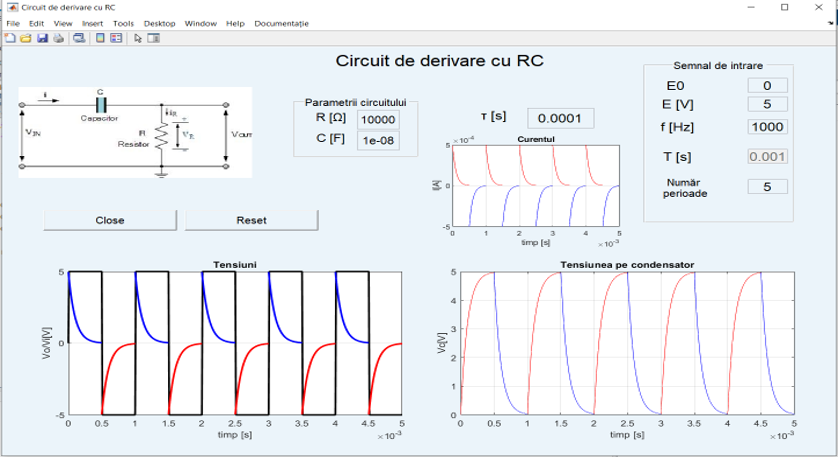

# RC Differentiator Circuit Simulation (MATLAB GUI)

This MATLAB project provides a **Graphical User Interface (GUI)** to simulate an **RC differentiator circuit**. Users can input circuit parameters and signal characteristics, visualize voltages, currents, and outputs, and analyze the behavior of the RC circuit over multiple periods.



## Features

- Interactive MATLAB GUI
- User-defined parameters:
  - Resistor \(R\) [Ω]
  - Capacitor \(C\) [F]
  - Input voltage amplitude \(E\) [V] and DC offset \(E0\) [V]
  - Frequency \(f\) [Hz] and number of periods \(N\)
- Plots:
  - Input voltage \(V_i(t)\)
  - Capacitor voltage \(V_c(t)\)
  - Output voltage across resistor \(V_o(t)\)
  - Circuit current \(I(t)\)
- Real-time parameter updates
- Validation for invalid inputs (zero or negative values)
- Easy start using `start.m` script

## Files

- `derivare.m` – Main GUI script  
- `F1.m` – ODE function for the charging phase  
- `F2.m` – ODE function for the discharging phase  
- `start.m` – Script to launch the GUI with default parameters  
- `Circuit.jpg` – Screenshot of the circuit schematic  
- Optional HTML documentation:
  - `titlu_proiect.htm`
  - `Descriere_proiect.htm`
  - `Functionare.htm`
  - `Ecuatii_proiect.htm`
  - `utilizare_interfata.htm`
  - `Bibliografie.htm`

## Installation

1. Make sure you have MATLAB installed (R2018b or newer recommended).  
2. Clone the repository:
   ```bash
   git clone https://github.com/FloricaDolca/RC-Differentiator-GUI.git ``` 
3. Open MATLAB and navigate to the project folder.

## Usage

### 1. Using `start.m` (recommended)
Run the script to launch the GUI with default parameters:

```matlab
start
```
**Default parameters:**

- `E0 = 0 V`
- `E = 5 V`
- `f = 1000 Hz`
- `N = 5 periods`
- `R = 10 kΩ`
- `C = 10 nF`
- `τ = R * C`
- `D = 0.5`

### 2. Directly calling `derivare.m`
You can run the GUI with custom parameters:

```matlab
derivare(E, T, f, N, R, C, tau, D, E0)
```
**Example:** 
```matlab
derivare(5, 0.001, 1000, 5, 10000, 10e-9, 0.0001, 0.5, 0)
```
Once the GUI is open, adjust the parameters using the input fields. 
Use the Reset button to restart the simulation and the Close button to exit the GUI.

### Notes

- Ensure that the capacitor `C` and frequency `f` are not zero.
- The GUI automatically calculates the time constant `τ = R * C`.
- Invalid or negative inputs trigger error messages.
